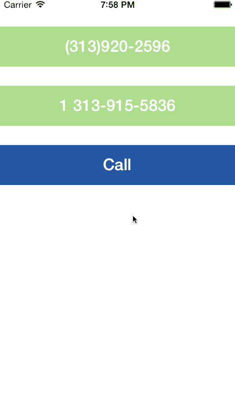

# PhoneKit

PhoneKit is an easy to use extension/wrapper of the Twilio Client iOS SDK for easily making/receiving VoIP calls from inside your iOS app.



## Features

- a simple API for making calls to real phones or other clients
- a full-featured modal view controller to allow your users to interact with the call
- options to mute, switch to speakerphone, and send DTMF tones
- a property to set the caller ID
- a call record object containing useful information about a past call
- useful helper methods on NSString for dealing with phone numbers

## Server

[Twilio Client Server](https://github.com/jconst/twilio-client-server)

Unfortunately, the Twilio Client SDK requires all client-side apps to have a custom server-side counterpart that issues your app capability tokens and hosts TwiML to handle the calls. To hopefully make your life easier, I've created the [repo above](https://github.com/jconst/twilio-client-server) to address the server-side needs of the most common use cases for Twilio Client. It can be easily deployed to your heroku account in about a minute – simply follow the readme on that repo to get the server set up.

## Demo

To run the example project, clone the repo, and run `pod install` from the Example directory first. Then, change the value of `kServerBaseURL` at the top of `PKTViewController.m` to point to `auth.php` on your server.

After starting the app, you can press "Call" immediately to hear a simple demo message. To call a real phone, you must first set the caller ID field to a number you have [verified with Twilio](https://www.twilio.com/user/account/phone-numbers/verified). Then simply type the callee's phone number (don't worry about the formatting) into the Callee text field and press Call.

## Installation

PhoneKit is available through [CocoaPods](http://cocoapods.org). To install
it, simply add the following line to your Podfile:

    pod "PhoneKit"

## Usage

After grabbing the token from auth.php, hand it to the Phone:

```objc
[PKTPhone sharedPhone].capabilityToken = token;
```

Set an optional caller ID:

```objc
[PKTPhone sharedPhone].callerId = @"1(555)867-5309";
```

I recommend using the provided PKTCallViewController for your call UI:
```objc
self.callViewController = [PKTCallViewController new];
[PKTPhone sharedPhone].delegate = self.callViewController;
```

Make a call!
```objc
[[PKTPhone sharedPhone] call:@"1 555-234-5678"];
```

## Author

Joseph Constantakis, jconstantakis@twilio.com

## License

PhoneKit is available under the MIT license. See the LICENSE file for more info.

